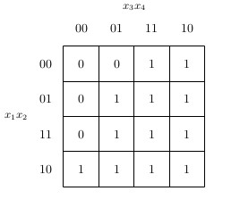
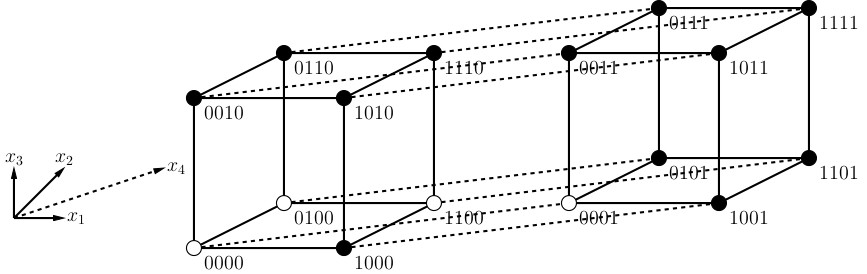

論理関数に関する処理
====================

論理値(Bool3)
-------------

論理値は `lctools.Bool3` を用いて表す．
本来，論理値は真と偽の2値であるが，
`lctools` では不完全指定論理関数を扱うために
ドントケアを含めた3値を扱う必要があるために
専用の列挙型として `Bool3` を用いる．

.. table::
   :align: left
   :widths: auto

   ===== ===========
   値    意味
   ===== ===========
   _0    偽(0)
   _1    真(1)
   _d    ドントケア
   ===== ===========

`Bool3` に関しては Python3 の組み込み型の
bool 型と同様に以下の論理演算をサポートしている．

.. table::
   :align: left
   :widths: auto

   ====== ============ ===================
   演算子 関数         意味
   ====== ============ ===================
   ~      __invert__   否定
   &      __and__      論理積
   \|     __or__       論理和
   ^      __xor__      排他的論理和
   <      __lt__       小なり比較
   >      __gt__       大なり比較
   <=     __le__       小なりイコール比較
   >=     __ge__       小なりイコール比較
   ====== ============ ===================

否定演算の真理値表は以下の通り

.. table::
   :align: left
   :widths: auto

   === ===
   x   ~x
   === ===
   _0  _1
   _1  _0
   _d  _d
   === ===

AND演算の真理値表は以下の通り

.. table::
   :align: left
   :widths: auto

   == == =====
   x  y  x & y
   == == =====
   _0 _0 _0
   _0 _1 _0
   _0 _d _0
   _1 _0 _0
   _1 _1 _1
   _1 _d _d
   _d _0 _0
   _d _1 _d
   _d _d _d
   == == =====

OR演算の真理値表は以下の通り

.. table::
   :align: left
   :widths: auto

   == == ======
   x  y  x \| y
   == == ======
   _0 _0 _0
   _0 _1 _1
   _0 _d _d
   _1 _0 _1
   _1 _1 _1
   _1 _d _1
   _d _0 _d
   _d _1 _1
   _d _d _d
   == == ======

XOR演算の真理値表は以下の通り

.. table::
   :align: left
   :widths: auto

   == == ======
   x  y  x ^ y
   == == ======
   _0 _0 _0
   _0 _1 _1
   _0 _d _d
   _1 _0 _1
   _1 _1 _0
   _1 _d _d
   _d _0 _d
   _d _1 _d
   _d _d _d
   == == ======

大小比較演算は本来のブール代数では定義されていないが，
ここでは便宜上 `_0` ， `_1` ， `_d` をそれぞれ0, 1, 2 と
みなして比較を行った結果を返す．
また，列挙型の値はハッシュ可能であるのでPythonのdict
のキーとして用いることもできる．

論理関数(BoolFunc)
------------------

論理関数を表すには `lctools.BoolFunc` を用いる．
`BoolFunc` は内部では2^n個の `Bool3` を持つ(nは入力数)．
そのため，多くの入力を持つ関数を扱うことはできない．

BoolFuncの生成
^^^^^^^^^^^^^^

BoolFunc のオブジェクト単純に生成にするには以下の形式を用いる．

::

   n = 2

   list1 = [Bool3._0, Bool3._1, Bool3._1, Bool3._0]
   f1 = BoolFunc(n, val_list=list1)

   str2 = "0110"
   f2 = BoolFunc(n, val_str=str2)

この場合， `f1` も `f2` も2入力の排他的論理和(XOR)を表す論理関数となる．
`BoolFunc` は必ず1つの位置引数(上の例では `n` )を取る．
この引数の値が生成される論理関数の入力数となる．
それ以外の引数は名前付きオプション引数である．
例から明らかなように `val_list` には生成する関数の内容を表す
`Bool3` のリストを与える．
`val_str` には生成する関数の内容を表す文字列を与える．
この文字列で用いられる文字は 0, 1, *, -, d のいずれかである．
このうち 0 と 1 以外の文字はドントケアを表す．
`val_list` も `val_str` も要素数は2^nに等しくなければならない．
`val_list` と `val_str` のオプション引数は2つ同時に指定することはできない．
`BoolFunc` には3番目のオプション引数`var_map`を指定することもできる．
`var_map` には整数値をキーとして文字列を値としたdictを与える．
その名前から推測されるように `var_map` は変数名を与える目的で用いられる．
論理関数にとって変数は順番のみが意味を持ち，
論理関数の演算にとっては変数名は意味を持たないが，
関数の内容を出力する際に用いられる．
ただし，論理関数を出力する際に別の変数名の辞書を与えることも可能である．

`BoolFunc` の内容は生成時以外には変更することはできない．
そのため，いかなる場合でも直接的・間接的に上記の初期化関数を用いる以外に
`BoolFunc` の内容を設定することはできない．
しかし，上記の初期化関数では関数の真理値表形式を表現を作る必要があり，
複雑な関数を作る場合には適切なインターフェイスとは言えない．
そこで，いくつかの便利関数として`BoolFunc`のクラス関数(Pythonの@staticmethod)
を用意している．

.. table::
   :align: left
   :widths: auto

   =============================== ========================
   関数名                          説明
   =============================== ========================
   make_const0(input_num)          定数0関数を作る．
   make_const1(input_num)          定数1関数を作る．
   make_literal(input_num, var_id) リテラル関数を作る．
   make_and(input_num)             AND関数を作る．
   make_nand(input_num)            NAND関数を作る．
   make_or(input_num)              OR関数を作る．
   make_nor(input_num)             NOR関数を作る．
   make_xor(input_num)             XOR関数を作る．
   make_xnor(input_num)            XNOR関数を作る．
   =============================== ========================

上記の関数はすべてオプション引数として `var_map` を受け取ることもできる．
意味は初期化関数と同一である．
共通の位置引数 `input_num` には生成する関数の入力数を与える．
`BoolFunc.make_literal(input_num, var_id)` は `var_id`
の変数が1のとき出力が1となるリテラル関数を生成する．
もしも否定のリテラル関数が必要な場合には，
この結果に否定演算子を適用すればよい．

より複雑な関数を作る手段としてさらにいくつかの関数が用意されている．
その一つはクラス関数 `make_from_string(expr_string, input_num, var_map)`
である． `expr_string` には論理式を表す文字列を与え，
`input_num` ，`var_map` にそれぞれ入力数と変数名の辞書を与える．
他の関数とは異なり，この関数では変数名の辞書は必須の引数となっている．

::

   expr_str = "0 & 1 | ~2 & ~3"
   var_map = {0:'x_1', 1:'x_2', 2:'x_3', 3:'x_4'}
   f = BoolFunc.make_from_string(expr_str, 4, var_map)

もう一つの方法は `BoolFunc` オブジェクトに対して論理演算を適用して新しい
論理関数を生成するものである．
`BoolFunc` の特殊メソッドとして通常の論理演算と同様の演算子が定義されている．
これらはすべて `BoolFunc` を入力として `BoolFunc` を結果として出力する．
この論理演算子を組み合わせることで，通常のPythonの式の形で論理関数を生
成することが可能である．
この方法で論理関数を生成するプログラム例を以下に示す．
詳細は論理演算の項を参照の事．

::

   INPUT_NUM = 4
   x1 = BoolFunc.make_literal(INPUT_NUM, 0)
   x2 = BoolFunc.make_literal(INPUT_NUM, 1)
   x3 = BoolFunc.make_literal(INPUT_NUM, 2)
   x4 = BoolFunc.make_literal(INPUT_NUM, 3)
   f = x1 & x2 | ~x3 & ~x4

論理演算
^^^^^^^^

`BoolFunc` では論理演算系の特殊メソッドを定義しているため，
`BoolFunc` どうしの論理演算を行なうことができる．
自明なように，論理関数どうしの論理演算の結果は論理関数となる．
その内容は，個々の入力値に対する出力値( `Bool3` )に対して
同様の論理演算を行ったものと等しい．
例えば2つの論理関数 :math:`f_1(x)` と :math:`f_2(x)`
に対するAND演算(&)の結果を :math:`g(x)`
とすると次式が成り立つ．

.. math::

   \forall x, g(x) = f_1(x) \& f_2(x)

この式の右辺は関数 :math:`f_1` と :math:`f_2`
の間で演算を行っているのではなく，
論理値 :math:`f_1(x)` と :math:`f_2(x)`
の間で演算を行っていることに注意．

このように論理値( `Bool3` )上で定義された演算を使って，
論理関数( `BoolFunc` )上の演算を定義することができる．
そこで，以下のような論理演算が定義されている．

.. table::
   :align: left
   :widths: auto

   ====== ============ ===================
   演算子 関数         意味
   ====== ============ ===================
   ~      __invert__   否定
   &      __and__      論理積
   \|     __or__       論理和
   ^      __xor__      排他的論理和
   ====== ============ ===================

このうち，論理否定(~)は単項演算であるため，
どのような `BoolFunc` オブジェクトに対しても正しく動く．
一方残りの演算子は二項演算なので，
オペランドの2つのオブジェクトがともに `BoolFunc` である必要がある．
さらに，2つの論理関数の入力数が等しくなければならない．

また，2つの関数が等しいかの比較を行なう `==` 演算子も定義されている．
もちろん，オブジェクトとして同一かどうかではなく，
関数の内容が等価かどうかを調べる．

論理演算を行なう特別な関数として `compose` が用意されている．
これはもとの関数の入力変数を他の論理関数に置き換えるものである．
例を示す．

::

   from lctools import BoolFunc

   v1 = BoolFunc.make_literal(4, 0)
   v2 = BoolFunc.make_literal(4, 1)
   v3 = BoolFunc.make_literal(4, 2)
   v4 = BoolFunc.make_literal(4, 3)

   f1 = v1 & ~v2
   f2 = ~v1 & v3
   f3 = v2 & v4
   f4 = v1 & v3

   g = v1 | v2 | v3 | v4 # BoolFunc.make_or(4) と等価

   ifunc_list = [f1, f2, f3, f4]
   h = g.compose(ifunc_list)

   # 結果は (v1 & ~v2) | (~v1 & v3) | (v2 & v4) | (v1 & v3)
   # と等価になる．

情報の取得
^^^^^^^^^^

論理関数に関する情報を取得するメソッドは以下の通り．

.. table::
   :align: left
   :widths: auto

   ================== ==============================
   関数名             説明
   ================== ==============================
   input_num          入力数を返す．@property
   input_var(pos)     pos番目の変数名を返す．
   val(ival_list)     入力値に対する関数値を返す．
                      ival_list は入力値のリスト
   var_map            変数名の辞書(変数番号がキー)
	              を返す．@property
   gen_minterm_list() on-set, dc-set, off-set
                      を表す最小項のリストを返す．
		      結果は Cube の list の tuple
   ================== ==============================

内容の出力
^^^^^^^^^^

論理関数の内容を出力するメソッドは以下の通り．

.. table::
   :align: left
   :widths: auto

   ========================================== ==========================================
   関数名                                     説明
   ========================================== ==========================================
   print_table()                              内容を真理値表の形式で出力する．
   print_karnaugh()                           内容をかるノーズの形式で出力する．
   gen_latex_minterm_sop()                    積和標準形をLaTeX形式で出力する．
   gen_latex_maxterm_pos()                    和積標準形をLaTeX形式で出力する．
   gen_latex_table(fname)                     真理値表をLaTeX形式で出力する．
                                              真理値表の右上に表示される関数名を
			                      fname で指定する．
   gen_latex_tables(func_list, fname_list)    複数の関数をまとめた真理値表をLaTeX形式で
                                              出力する．@staticmethod
   gen_latex_karnaugh(implicant_list=None)    カルノー図をLaTeX形式で出力する．
                                              LaTeX側で `karnaugh.sty`
					      を用いる必要がある．
					      implicant_list に Cube のリストを与えると
					      カルノー図上で堰項を表示するようになる．
   gen_dpic_hypercube()                       幾何学表現用のLaTeXソースを出力する．
                                              正確には dpic 用のm4マクロを出力する．
   ========================================== ==========================================

これらの関数はすべて名前付きのオプション引数として `var_map` および
`fout` を受け取る．
`var_map` には変数名の辞書を与える．
省略時には `BoolFunc` オブジェクト固有の var_map を用いる．
`fout` には出力先のファイルオブジェクトを与える．
省略時には標準出力が用いられる．

::

   from lctools import BoolFunc

   v1 = BoolFunc.make_literal(4, 0)
   v2 = BoolFunc.make_literal(4, 1)
   v3 = BoolFunc.make_literal(4, 2)
   v4 = BoolFunc.make_literal(4, 3)

   f = (v1 & ~v2) | (~v1 & v3) | (v2 & v4) | (v1 & v3)

この `f` に対する出力結果を以下に示す．

::

   f.print_table()

    x_1 x_2 x_3 x_4| f
   ----------------+--
     0   0   0   0 | 0
     0   0   0   1 | 0
     0   0   1   0 | 1
     0   0   1   1 | 1
     0   1   0   0 | 0
     0   1   0   1 | 1
     0   1   1   0 | 1
     0   1   1   1 | 1
     1   0   0   0 | 1
     1   0   0   1 | 1
     1   0   1   0 | 1
     1   0   1   1 | 1
     1   1   0   0 | 0
     1   1   0   1 | 1
     1   1   1   0 | 1
     1   1   1   1 | 1

::

   f.print_karnaugh()

    x_3x_4|00|01|11|10|
      \   |  |  |  |  |
    x_1x_2|  |  |  |  |
   -------+--+--+--+--+
     00   | 0| 0| 1| 1|
   -------+--+--+--+--+
     01   | 0| 1| 1| 1|
   -------+--+--+--+--+
     11   | 0| 1| 1| 1|
   -------+--+--+--+--+
     10   | 1| 1| 1| 1|

::

   f.gen_latex_minterm_sop()

.. math::

   \bar{x_1}\bar{x_2}x_3\bar{x_4} + \bar{x_1}\bar{x_2}x_3x_4 + \bar{x_1}x_2\bar{x_3}x_4 + \bar{x_1}x_2x_3\bar{x_4} + \bar{x_1}x_2x_3x_4 + x_1\bar{x_2}\bar{x_3}\bar{x_4} + x_1\bar{x_2}\bar{x_3}x_4 + x_1\bar{x_2}x_3\bar{x_4} + x_1\bar{x_2}x_3x_4 + x_1x_2\bar{x_3}x_4 + x_1x_2x_3\bar{x_4} + x_1x_2x_3x_4

::

   f.gen_latex_maxterm_pos()

.. math::

   (x_1 + x_2 + x_3 + x_4)(x_1 + x_2 + x_3 + \bar{x_4})(x_1 + \bar{x_2} + x_3 + x_4)(\bar{x_1} + \bar{x_2} + x_3 + x_4)

::

   f.gen_latex_table('f_1')

.. math::

   \begin{tabular}{|cccc|c|}
   \hline
   $x_1$ & $x_2$ & $x_3$ & $x_4$ &  $f_1$\\
   \hline \hline
   0 & 0 & 0 & 0 & 0\\
   0 & 0 & 0 & 1 & 0\\
   0 & 0 & 1 & 0 & 1\\
   0 & 0 & 1 & 1 & 1\\
   0 & 1 & 0 & 0 & 0\\
   0 & 1 & 0 & 1 & 1\\
   0 & 1 & 1 & 0 & 1\\
   0 & 1 & 1 & 1 & 1\\
   1 & 0 & 0 & 0 & 1\\
   1 & 0 & 0 & 1 & 1\\
   1 & 0 & 1 & 0 & 1\\
   1 & 0 & 1 & 1 & 1\\
   1 & 1 & 0 & 0 & 0\\
   1 & 1 & 0 & 1 & 1\\
   1 & 1 & 1 & 0 & 1\\
   1 & 1 & 1 & 1 & 1\\
   \hline
   \end{tabular}

`gen_latex_table()` に与える関数名はLaTeXソース中では `\$`
で囲まれているのでLaTeXの数式モードで使用可能な記法を使うことができる．

::

   g = ~f

   BoolFunc.gen_latex_tables([f, g], ['f', 'g'])

.. math::

   \begin{tabular}{|cccc|cc|}
   \hline
   $x_1$ & $x_2$ & $x_3$ & $x_4$ &  $f$ &  $g$\\
   \hline \hline
   0 & 0 & 0 & 0 & 0 & 1\\
   0 & 0 & 0 & 1 & 0 & 1\\
   0 & 0 & 1 & 0 & 1 & 0\\
   0 & 0 & 1 & 1 & 1 & 0\\
   0 & 1 & 0 & 0 & 0 & 1\\
   0 & 1 & 0 & 1 & 1 & 0\\
   0 & 1 & 1 & 0 & 1 & 0\\
   0 & 1 & 1 & 1 & 1 & 0\\
   1 & 0 & 0 & 0 & 1 & 0\\
   1 & 0 & 0 & 1 & 1 & 0\\
   1 & 0 & 1 & 0 & 1 & 0\\
   1 & 0 & 1 & 1 & 1 & 0\\
   1 & 1 & 0 & 0 & 0 & 1\\
   1 & 1 & 0 & 1 & 1 & 0\\
   1 & 1 & 1 & 0 & 1 & 0\\
   1 & 1 & 1 & 1 & 1 & 0\\
   \hline
   \end{tabular}

::

   f.gen_latex_karnaugh()

::

   f.gen_dpic_hypercube()

この関数の出力するファイルの形式はm4マクロと呼ばれる
マクロプリプロセッサのソースファイルで，
`circuit_macros` と呼ばれる回路図描画用のマクロライブラリ
を適用した後で `dpic` と呼ばれるプログラムで LaTeX 用の
描画形式(Tikz/PGF)に変換する．
最後にLaTeXで画像生成を行っている．

積項(Cube)
-----------

積和形論理式の積項を表すためのクラス．
意味的には `Bool3` の入力数分のリストである．
対応する位置の値が `Bool3._0` の場合，
その変数の否定のリテラルが含まれている．
一方， `Bool3._1` の場合，
その変数の工程のリテラルが含まれている．
`Bool3._d` の場合，その変数は含まれない．

Cube の生成
^^^^^^^^^^^

Cube の生成時に与えらることのできる引数は
通常は文字列 `pat_str` であるが，
名前付きのオプション引数である `input_num` を与えることもできる．
両方の引数を省略することはできない．
`input_num` のみが指定された場合には，
指定された入力数分の「空」の堰項が作られる．
`pat_str` のみが指定された場合には，
`pat_str` の文字数が入力数となる．
`input_num` と `pat_str` の両方が指定された時には
`pat_str` の文字数と `input_num` の値は等しくなければならない．
`pat_str` は `0` ， `1` ， `-` ， `*` からなる．
`0` は否定， `1` は肯定のリテラル，
`-` ， `*` はその変数が現れないことを示す．

`a` ， `b` ， `c` の3つの変数からなる3次元のブール空間上
の :math:`a\bar{b}` というキューブ(堰項)を生成するコード
は以下のようになる．

::

   from lctools import Cube

   c = Cube('10-')

実際には Cube は変数名に関する情報は持たない．
変数のリテラルを用いた積項表現を出力する場合には別途変数名の辞書を与える必要がある．

以下の2つのキューブは同じ内容となる．

::

   from lctools import Cube

   c1 = Cube(input_num=4)
   c2 = Cube('----')

Cube の内容に対するアクセス
^^^^^^^^^^^^^^^^^^^^^^^^^^^

Cube は生成したあとでも内容を変更することが可能である．
そのための関数を以下に示す．

.. table::
   :align: left
   :widths: auto

   ====================  ========================================
   関数                  説明
   ====================  ========================================
   set_posiliteral(pos)  pos番目の変数の肯定のリテラルを加える．
   set_negaliteral(pos)  pos番目の変数の否定のリテラルを加える．
   clr_literal(pos)      pos番目の変数のリテラルを取り除く．
   ====================  ========================================

これらの関数は対象の変数に関する従来の設定を上書きする．

::

   from lctools import Cube

   c = Cube('1-0')

でキューブを生成した場合，このキューブは0番目の変数の肯定のリテラルと
2番目の変数の否定のリテラルを持つ．
これに対して，

::

   c.set_negaliteral(0)

を実行した場合，もともとの内容は上書きされて，
0番目の変数の否定のリテラルを持つようになる．
0番目の変数の肯定のリテラルは削除される．
つまり，同じ変数の肯定と否定のリテラルを同時に持つことはできない．

`Cube`  の要素に対するアクセスを配列(リスト)のように行なうことも可能である．
この場合， `Cube` はあたかも `Bool3` の配列であるかのように振る舞う．

::

   from lctools import Cube, Bool3

   c = Cube('01-')

   v1 = c[1] # v1 == Bool3._1
   c[2] = Bool3._0

   n = len(c) # n == 3

その他，キューブの諸元を取得する関数として以下のものがある．

.. table::
   :align: left
   :widths: auto

   =============== ==========================
   関数            説明
   =============== ==========================
   input_num       入力変数の数 @property
   literal_num     リテラル数 @property
   =============== ==========================

特殊な演算
^^^^^^^^^^

後述する主項の導出のために特殊な演算を定義している．
ただし，見かけは論理演算のOR演算の様に見せかけている．

::

   from lctools import Cube

   c1 = Cube('10-')
   c2 = Cube((11-')

   d = c1 | c2

   # d は '1--' となる．

この例の様にただ一つの変数に関するリテラルのみが相異なる2つのキューブ
のOR演算を行なうと結果もキューブとなる．
`Cube` のOR演算(|)はこのように結果がキューブとなる場合のみ
結果の `Cube` を生成しそれを返す．
それ以外の場合には None を返す．

比較演算
^^^^^^^^^^^^

内容を `Bool3` のリストと見なして辞書式順序で比較を行なう比較演算を定義している．
`Cube` における大小比較は積項の包含関係とは無関係であることに注意．
等価比較およびハッシュ関数も定義しているので dict のキーとして用いることも可能である．

内容の出力
^^^^^^^^^^^^

積項を表す論理式をLaTeX形式で出力するには以下のコードのように行なう．

::

   from lctools import Cube

   c = Cube('10-')
   s = c.latex_str(var_map={0: 'a', 1: 'b', 2: 'c'})

結果として得られる `s` の内容をLaTeXで処理すると
:math:`a\bar{b}` のような出力が得られる．

特殊な用途で DeMorgan の法則を用いた否定形の積和形論理式を作るには以下
のようにする．

::

   from lctools import Cube

   c = Cube('10-')
   s = c.DeMorgan_latex_str(var_map={0: 'a', 1: 'b', 2: 'c'})

結果として :math:`(\bar{a} + b)` が得られる．

積和形論理式(Cover)
----------------------

ここでは慣例に従って積和形論理式を表す用語として `Cover`
を用いる．
積和形論理式は積項の論理和であるが，
このクラスでは `Cube` のリストという形で積和形論理式を表している．
`Cover` の生成時に `Cube` のリストを引数として渡すことで内容を初期化することができる．
要素の `Cube` はメソッド `add_cube(cube)` で追加することもできる．

内容の出力
^^^^^^^^^^^^

内容をLaTeX形式で出力するには以下のように `latex_str()` を用いる．

::

   from lctools import Cube, Cover

   c1 = Cube('01-')
   c2 = Cube('-01')

   f = Cover([c1, c2])

   s = f.latex_str(var_map={0: 'a', 1: 'b', 2: 'c'})

結果は :math:`\bar{a}b + \bar{b}c` のようになる．

特殊な用途で DeMorgan の法則を用いた否定形の和積形論理式を作るには以下
のようにする．

::

   from lctools import Cube, Cover

   c1 = Cube('01-')
   c2 = Cube('-01')

   f = Cover([c1, c2])

   s = f.DeMorgan_latex_str(var_map={0: 'a', 1: 'b', 2: 'c'})

結果は :math:`(a + \bar{b})(b + \bar{c})` のようになる．

最簡形論理式の導出
------------------

与えられた論理関数の最簡形積和形論理式を求めるためには
`lctools.qm` を用いる．

主項の列挙
^^^^^^^^^^

Quine の定理により，最簡形積和形論理式は主項のみから構成されるので，
まず最初に主項の列挙を行なう．
そのためには `lctools.qm.gen_primes(minterm_list)` を用いる．
ここで `minterm_list` は対象の論理関数の最小項のリストである．
結果として主項を表す `Cube` のリストが返される．

通常は `minterm_list` としてオンセットの最小項のリストを与えるが，
対象の関数がドントケアを含む不完全指定論理関数の場合には，
オンセットとドントケアセットの最小項のリストを与える．

最簡形を得るためには主項のなかからオンセットの最小項を被覆する
最小被覆を求める必要がある．
そのために `lctools.MinCov` を用いる．
まず， `
